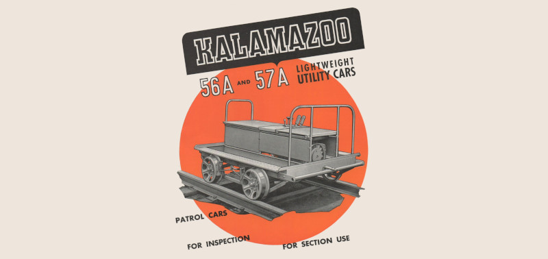

<div align="center">

# Kalamazoo



### A minimal Rails template. For shipping stuff, fast 🚀

</div>

## Usage

```
rails new your-project-name -d sqlite3 --skip-js --skip-rubocop --skip-system-test \
  -m https://raw.githubusercontent.com/hschne/kalamazoo/main/template.rb
```

`--skip-js` (Vite owns JavaScript) and `--skip-rubocop` (standard instead) are
required for a clean result.

## What you get

- Rails 8 on SQLite, with `solid_cache` / `solid_queue` / `solid_cable`
- Vite + Tailwind CSS 4 + daisyui (pnpm), source in `app/javascript`
- Hotwire (Turbo + Stimulus, auto-registered)
- reactionview (herb-backed ERB)
- standard, herb, annotaterb
- mise for tool versions (`.ruby-version`, `.node-version`) and pnpm via corepack
- Rails' default CI, extended with Node + pnpm so view tests build Vite assets

## Development

```
mise install        # ruby + node from the version files, pnpm via corepack
bin/dev             # Rails + Vite
```
